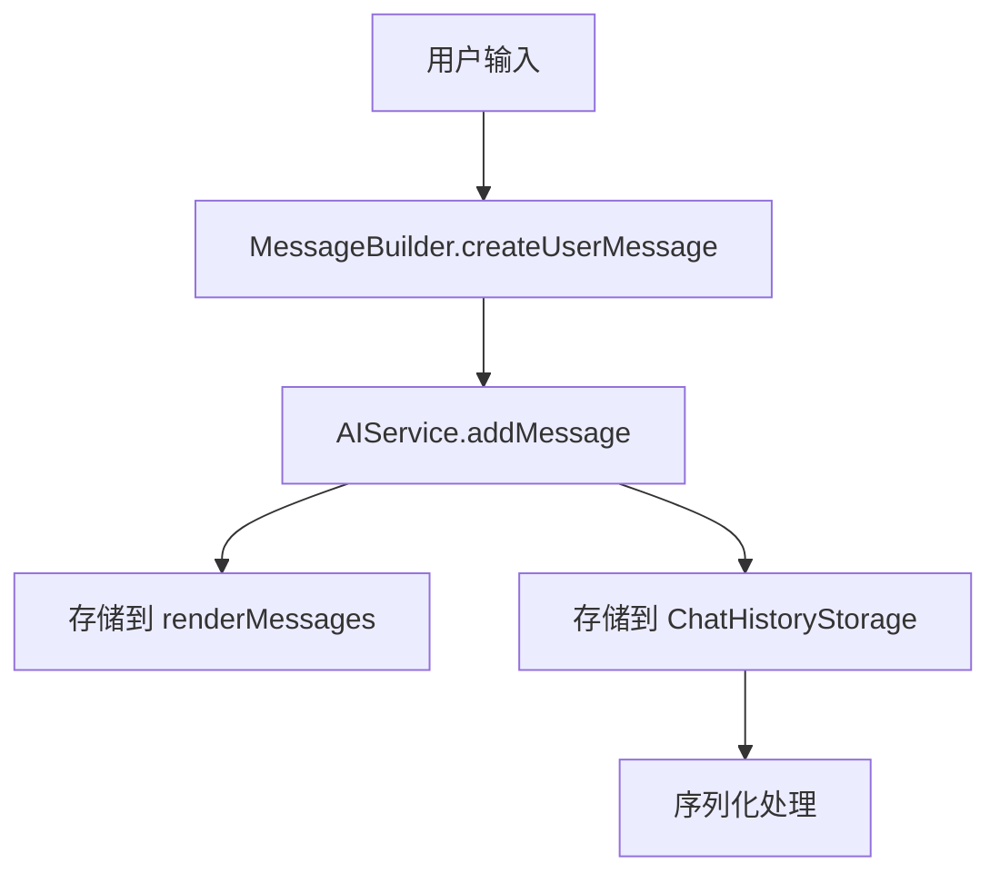
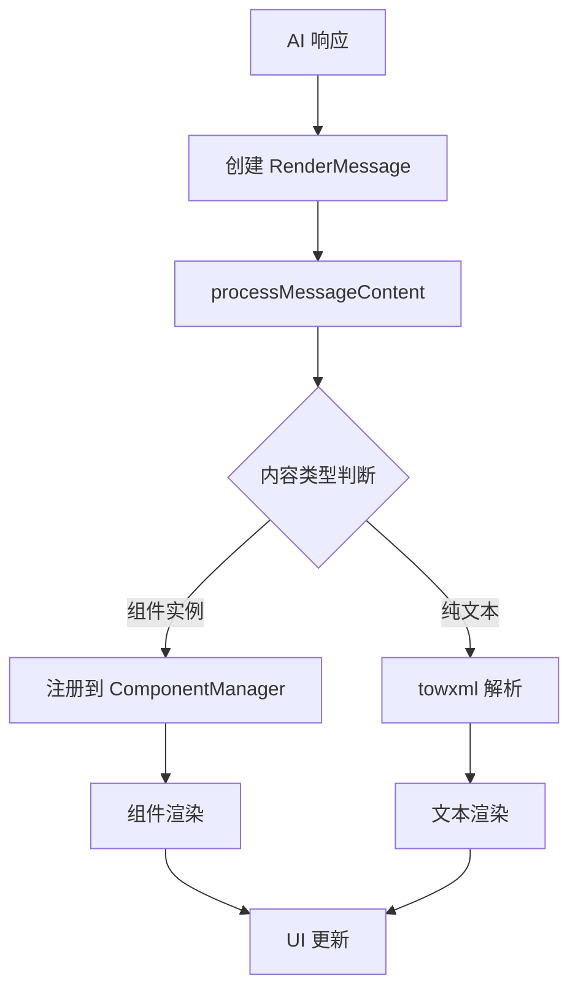
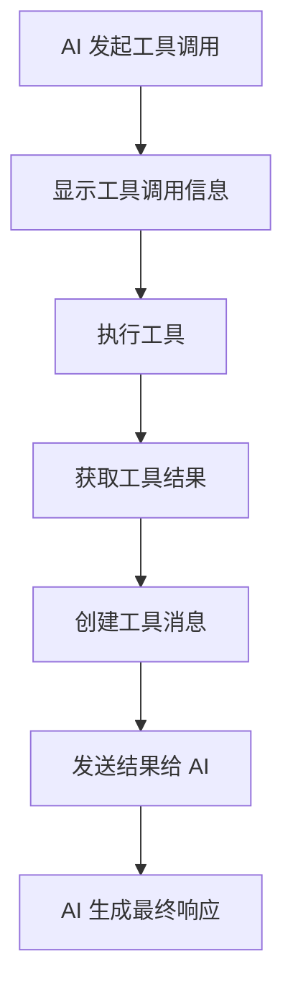

# AI 消息渲染架构文档

## 概述

本文档详细介绍了小程序中 AI 消息处理和渲染的完整架构，包括消息类型设计、组件系统、渲染流程和相关的最佳实践。

## 核心架构设计

### 1. 消息类型分离设计

我们采用了**双层消息架构**，将 AI 通信和内部渲染完全分离：

```typescript
// AI 通信层 - 标准化格式
interface AIMessage {
  role: 'user' | 'assistant' | 'system' | 'tool'
  content: string | null
  tool_call_id?: string
  tool_calls?: ToolCall[]
  name?: string
}

// 渲染层 - 支持复杂组件
interface RenderMessage {
  id: string
  role: 'user' | 'assistant' | 'system' | 'tool'
  content: RenderNode          // 可以是字符串或组件实例
  plainContent?: string        // 纯文本缓存
  towxmlNodes?: TowxmlNode    // towxml 解析结果
  tool_call_id?: string
  tool_calls?: ToolCall[]
  timestamp: number
}
```

### 2. 架构优势

- **清晰的职责分离**：AI 通信只处理纯文本，渲染层处理复杂组件
- **类型安全**：避免了复杂类型在不同层级间的错误传递
- **性能优化**：减少不必要的类型转换和序列化开销
- **可维护性**：每一层的逻辑独立，便于调试和扩展

## 消息流转架构

### 1. 用户消息流程



### 2. AI 响应流程



### 3. 工具调用流程



## 组件系统架构

### 1. 组件基础设施

```typescript
// 基础组件类
abstract class BaseComponent {
  abstract getComponentType(): string
  abstract getComponentId(): string
  abstract render(): string
  abstract executeAction(action: string, event?: any): void
  abstract serialize(): any
  static deserialize(data: any): BaseComponent
}

// 组件管理器
class ComponentManager {
  private components: Map<string, BaseComponent>
  
  registerComponent(component: BaseComponent): void
  handleComponentEvent(componentId: string, eventName: string, event?: any): boolean
  deserializeAndRegister(data: any): BaseComponent
}
```

### 2. 组件生命周期

1. **创建阶段**：工具执行时创建组件实例
2. **注册阶段**：注册到 ComponentManager
3. **渲染阶段**：调用 render() 方法生成 HTML
4. **交互阶段**：处理用户交互事件
5. **序列化阶段**：保存到存储时序列化
6. **反序列化阶段**：从存储加载时重建
7. **销毁阶段**：会话切换时清理

### 3. 组件事件处理

```typescript
// 事件处理流程
handleComponentEvent(e: WxEvent) {
  const eventData = e.currentTarget?.dataset?.data?.attrs || {}
  const componentId = eventData['data-component-id']
  const eventName = eventData['data-action']
  
  const componentManager = getComponentManager()
  componentManager?.handleComponentEvent(componentId, eventName, e)
}
```

## 渲染系统架构

### 1. Towxml 集成

我们使用 towxml 库来处理 Markdown 和 HTML 渲染：

```typescript
processMessageContent(content: RenderNode): TowxmlNode | undefined {
  try {
    let html: string
    
    if (content instanceof BaseComponent) {
      const componentManager = getComponentManager()
      componentManager?.registerComponent(content)
      html = content.render()
    } else {
      html = String(content)
    }
    
    return app.towxml(html, 'html', {
      events: {
        tap: (e: WxEvent) => this.handleComponentEvent(e)
      }
    })
  } catch (error) {
    return app.towxml(String(content), 'text')
  }
}
```

### 2. 渲染流程

1. **内容类型检测**：判断是组件实例还是纯文本
2. **组件注册**：将组件实例注册到管理器
3. **HTML 生成**：调用组件的 render() 方法
4. **Towxml 解析**：将 HTML 转换为小程序可渲染的节点
5. **事件绑定**：绑定组件交互事件
6. **UI 渲染**：在页面中显示内容

### 3. 性能优化策略

- **纯文本缓存**：`plainContent` 字段避免重复文本提取
- **延迟渲染**：只在需要时才进行 towxml 解析
- **组件复用**：相同类型的组件实例可以复用
- **内存管理**：会话切换时及时清理组件实例

## 存储架构

### 1. 消息序列化

```typescript
private serializeContent(content: RenderNode): any {
  if (typeof content === 'string') return content
  if (Array.isArray(content)) return content.map(item => this.serializeContent(item))
  
  if (typeof content === 'object' && content !== null) {
    // 优先使用微信小程序格式
    if ('renderForMiniProgram' in content) {
      return content.renderForMiniProgram()
    }
    // 其次使用通用序列化格式
    if ('serialize' in content) {
      return content.serialize()
    }
  }
  
  return JSON.stringify(content)
}
```

### 2. 组件反序列化

```typescript
private deserializeContent(content: any): RenderNode {
  if (typeof content === 'string') return content
  if (Array.isArray(content)) return content.map(item => this.deserializeContent(item))
  
  if (content?.componentType) {
    const componentManager = ComponentManager.getInstance()
    return componentManager.deserializeAndRegister(content)
  }
  
  return content
}
```

### 3. 数据一致性保证

- **双向同步**：内存和存储层的数据保持同步
- **类型检查**：反序列化时验证数据类型
- **错误恢复**：序列化失败时提供降级方案
- **版本兼容**：支持不同版本的数据格式

## 工具调用架构

### 1. 工具执行流程

```typescript
// 工具管理器统一处理
class ToolManager {
  async executeTool(toolName: string, args: Record<string, unknown>): Promise<ToolCallResult> {
    const tool = this.tools.get(toolName)
    if (!tool) throw new Error(`未找到工具: ${toolName}`)
    
    return await tool.execute(args)
  }
}
```

### 2. 工具结果处理

```typescript
// 工具结果转换为渲染消息
private saveToolCallResults(toolResponses: any[]) {
  toolResponses.forEach(response => {
    if (response.originalData) {
      // 使用原始数据（可能包含组件实例）
      this.addMessage('tool', response.originalData, response.tool_call_id)
    } else {
      // 使用渲染后的内容
      this.addMessage('tool', response.content, response.tool_call_id)
    }
  })
}
```

### 3. 流式响应处理

- **实时更新**：工具调用状态实时显示
- **错误处理**：工具失败时显示错误信息
- **进度指示**：显示当前正在执行的工具
- **结果展示**：工具完成后显示结果

## 错误处理和容错机制

### 1. 分层错误处理

```typescript
// 组件渲染错误
try {
  html = content.render()
} catch (error) {
  console.error('组件渲染失败:', error)
  html = `[组件渲染错误: ${error.message}]`
}

// towxml 解析错误
try {
  return app.towxml(html, 'html')
} catch (error) {
  console.error('towxml 解析失败:', error)
  return app.towxml(String(content), 'text')
}
```

### 2. 降级策略

- **组件降级**：组件渲染失败时显示纯文本
- **解析降级**：HTML 解析失败时使用文本模式
- **功能降级**：ComponentManager 获取失败时跳过组件功能
- **数据降级**：序列化失败时使用 JSON 字符串

### 3. 错误监控

- **详细日志**：记录每个步骤的执行情况
- **错误分类**：区分不同类型的错误
- **用户友好**：向用户显示有意义的错误信息
- **自动恢复**：可能的情况下自动重试

## 最佳实践

### 1. 组件开发

```typescript
// 良好的组件设计示例
class WeatherCard extends BaseComponent {
  getComponentType(): string { return 'weather' }
  
  render(): string {
    // 返回完整的 HTML 结构
    return `
      <div class="weather-card" data-component-id="${this.getComponentId()}">
        <div class="weather-info">${this.data.city}</div>
        <button data-action="refresh">刷新</button>
      </div>
    `
  }
  
  executeAction(action: string): void {
    switch (action) {
      case 'refresh': this.refreshWeather(); break
      default: console.warn(`未知操作: ${action}`)
    }
  }
}
```

### 2. 消息处理

```typescript
// 使用 MessageBuilder 创建消息
const userMessage = MessageBuilder.createUserMessage(content)
const assistantMessage = MessageBuilder.createAssistantMessage(content, toolCalls)

// 使用 MessageConverter 进行转换
const aiMessages = MessageConverter.renderToAIHistory(renderMessages)
```

### 3. 性能优化

- **避免频繁的序列化/反序列化**
- **合理使用纯文本缓存**
- **及时清理不需要的组件实例**
- **优化大量消息时的渲染性能**

### 4. 调试技巧

- **使用 ComponentManager.getStatusSummary() 查看组件状态**
- **检查 plainContent 字段确认文本提取**
- **监控组件注册和销毁日志**
- **验证序列化/反序列化的数据完整性**

## 总结

这个架构提供了：

- ✅ **清晰的职责分离**：AI 通信和渲染完全独立
- ✅ **强大的组件系统**：支持复杂的交互式组件
- ✅ **可靠的错误处理**：多层次的容错机制
- ✅ **良好的性能**：优化的渲染和存储策略
- ✅ **易于扩展**：模块化的设计便于添加新功能

通过这个架构，我们实现了一个既能处理简单文本消息，又能支持复杂交互式组件的 AI 对话系统。
